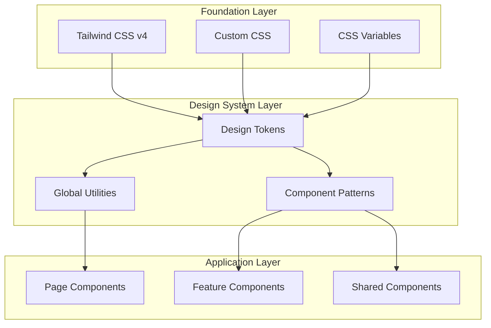

# Design Document

## Overview

The Design System Overhaul transforms the Plant Tracker App from its current inconsistent styling approach to a cohesive, mobile-first design system. The project establishes a comprehensive design token system with mint green and salmon colors that appeal to younger millennial women, consolidates scattered local stylesheets into global patterns, and ensures excellent mobile responsiveness and accessibility.

### Key Design Principles

- **Mobile-First**: All components designed for touch interaction with responsive breakpoints
- **Millennial Aesthetic**: Trendy mint green and salmon palette with soft, dreamy styling
- **Global Consistency**: Centralized design tokens and utility classes over local styles
- **Performance Focused**: Optimized CSS architecture with minimal bundle size
- **Accessibility First**: WCAG AA compliance with excellent usability for all users

## Architecture

### Current State Analysis

Based on code analysis, the current system has:

**Strengths:**
- Tailwind CSS v4 with custom theme configuration
- Good color palette foundation with mint green and salmon
- Some mobile optimizations (safe area utilities, touch manipulation)
- Basic design tokens in CSS custom properties

**Issues to Address:**
- Inconsistent component styling patterns
- Scattered className usage without global patterns
- Forms lack password manager compatibility
- Missing comprehensive mobile-first responsive system
- No standardized component library approach
- Redundant styling across components

### Target Architecture



## Components and Interfaces

### Design Token System

#### Enhanced Color Palette

Building on the existing mint green and salmon foundation, expand to a complete millennial-friendly palette:

```css
:root {
  /* Primary: Mint Green (Plant/Growth/Success) */
  --color-mint-50: #f0fdf4;
  --color-mint-100: #d1fae5;
  --color-mint-200: #a7f3d0;  /* Main brand color */
  --color-mint-300: #6ee7b7;
  --color-mint-400: #34d399;
  --color-mint-500: #10b981;
  --color-mint-600: #059669;
  
  /* Secondary: Salmon/Coral (Care/Love/Warmth) */
  --color-salmon-50: #fff1f2;
  --color-salmon-100: #ffe4e6;
  --color-salmon-200: #fecdd3;
  --color-salmon-300: #fda4af;  /* Main secondary color */
  --color-salmon-400: #fb7185;
  --color-salmon-500: #f43f5e;
  --color-salmon-600: #e11d48;
  
  /* Tertiary: Soft Lavender (Propagation/Growth) */
  --color-lavender-50: #f5f3ff;
  --color-lavender-100: #e0e7ff;
  --color-lavender-200: #c7d2fe;
  --color-lavender-300: #c4b5fd;
  --color-lavender-400: #a78bfa;
  
  /* Accent: Peachy Pink (Special features) */
  --color-peach-200: #fed7d7;
  --color-peach-300: #f9a8d4;
  --color-peach-400: #f472b6;
  
  /* Status Colors (Soft & Friendly) */
  --color-success: var(--color-mint-300);
  --color-warning: #fcd34d;
  --color-error: #fca5a5;
  --color-info: #93c5fd;
  
  /* Neutrals (Warm & Soft) */
  --color-neutral-50: #fefefe;
  --color-neutral-100: #faf9f7;
  --color-neutral-200: #f3f1ee;
  --color-neutral-300: #e5e3e0;
  --color-neutral-400: #9ca3af;
  --color-neutral-500: #6b7280;
  --color-neutral-600: #4b5563;
  --color-neutral-700: #374151;
  --color-neutral-800: #1f2937;
  --color-neutral-900: #111827;
}
```

#### Typography Scale

```css
:root {
  /* Font Families */
  --font-sans: -apple-system, BlinkMacSystemFont, 'Segoe UI', Roboto, 'Helvetica Neue', Arial, sans-serif;
  
  /* Font Sizes (Mobile-First) */
  --text-xs: 0.75rem;    /* 12px - Captions, metadata */
  --text-sm: 0.875rem;   /* 14px - Secondary text, labels */
  --text-base: 1rem;     /* 16px - Body text (prevents zoom on iOS) */
  --text-lg: 1.125rem;   /* 18px - Important body text */
  --text-xl: 1.25rem;    /* 20px - Card titles, plant names */
  --text-2xl: 1.5rem;    /* 24px - Section headings */
  --text-3xl: 1.875rem;  /* 30px - Page titles */
  --text-4xl: 2.25rem;   /* 36px - App title, major headings */
  
  /* Line Heights */
  --leading-tight: 1.25;
  --leading-snug: 1.375;
  --leading-normal: 1.5;
  --leading-relaxed: 1.625;
  
  /* Font Weights */
  --font-normal: 400;
  --font-medium: 500;
  --font-semibold: 600;
  --font-bold: 700;
}
```

#### Spacing System

```css
:root {
  /* Base spacing unit: 4px */
  --space-1: 0.25rem;   /* 4px */
  --space-2: 0.5rem;    /* 8px */
  --space-3: 0.75rem;   /* 12px */
  --space-4: 1rem;      /* 16px - Base unit */
  --space-5: 1.25rem;   /* 20px */
  --space-6: 1.5rem;    /* 24px */
  --space-8: 2rem;      /* 32px */
  --space-10: 2.5rem;   /* 40px */
  --space-12: 3rem;     /* 48px */
  --space-16: 4rem;     /* 64px */
  --space-20: 5rem;     /* 80px */
  --space-24: 6rem;     /* 96px */
  
  /* Touch targets */
  --touch-target-min: 44px;  /* iOS minimum */
  --touch-target-comfortable: 48px;  /* Preferred size */
}
```

#### Border Radius & Shadows

```css
:root {
  /* Border Radius */
  --radius-sm: 0.25rem;   /* 4px */
  --radius-md: 0.5rem;    /* 8px */
  --radius-lg: 0.75rem;   /* 12px */
  --radius-xl: 1rem;      /* 16px */
  --radius-2xl: 1.25rem;  /* 20px */
  --radius-3xl: 1.5rem;   /* 24px */
  --radius-full: 9999px;
  
  /* Shadows (Dreamy & Soft) */
  --shadow-sm: 0 1px 2px 0 rgba(167, 243, 208, 0.05);
  --shadow-md: 0 4px 6px -1px rgba(167, 243, 208, 0.1), 0 2px 4px -1px rgba(253, 164, 175, 0.06);
  --shadow-lg: 0 10px 15px -3px rgba(167, 243, 208, 0.1), 0 4px 6px -2px rgba(253, 164, 175, 0.05);
  --shadow-xl: 0 20px 25px -5px rgba(167, 243, 208, 0.1), 0 10px 10px -5px rgba(253, 164, 175, 0.04);
  --shadow-dreamy: 0 8px 32px -8px rgba(253, 164, 175, 0.15), 0 0 0 1px rgba(167, 243, 208, 0.05);
}
```

### Global Component Patterns

#### Form System

Create comprehensive form styling that addresses current issues:

```css
/* Form Base Styles */
.form-group {
  @apply space-y-2;
}

.form-label {
  @apply block text-sm font-medium text-neutral-700;
}

.form-input {
  @apply w-full px-4 py-3 text-base bg-white border border-neutral-300 rounded-lg;
  @apply placeholder-neutral-500 text-neutral-900;
  @apply focus:ring-2 focus:ring-mint-400 focus:border-mint-400;
  @apply transition-colors duration-200;
  font-size: 16px; /* Prevents zoom on iOS */
}

.form-input--error {
  @apply border-error bg-red-50;
}

.form-input--success {
  @apply border-success bg-mint-50;
}

.form-error {
  @apply text-sm text-error;
}

.form-help {
  @apply text-xs text-neutral-500;
}

/* Password Manager Compatibility */
.form-input[type="email"] {
  @apply autocomplete-email;
}

.form-input[type="password"] {
  @apply autocomplete-current-password;
}

.form-input[type="password"][data-new-password] {
  @apply autocomplete-new-password;
}
```

#### Button System

```css
/* Button Base */
.btn {
  @apply inline-flex items-center justify-center px-4 py-3 text-base font-medium rounded-lg;
  @apply transition-all duration-200 focus:ring-2 focus:ring-offset-2;
  @apply disabled:opacity-50 disabled:cursor-not-allowed;
  min-height: var(--touch-target-comfortable);
  touch-action: manipulation;
}

/* Button Variants */
.btn--primary {
  @apply bg-mint-400 text-white hover:bg-mint-500 focus:ring-mint-400;
  @apply shadow-md hover:shadow-lg;
}

.btn--secondary {
  @apply bg-salmon-300 text-white hover:bg-salmon-400 focus:ring-salmon-300;
  @apply shadow-md hover:shadow-lg;
}

.btn--tertiary {
  @apply bg-lavender-300 text-white hover:bg-lavender-400 focus:ring-lavender-300;
  @apply shadow-md hover:shadow-lg;
}

.btn--outline {
  @apply bg-white border-2 border-mint-300 text-mint-600;
  @apply hover:bg-mint-50 focus:ring-mint-400;
}

.btn--ghost {
  @apply bg-transparent text-neutral-600 hover:bg-neutral-100 focus:ring-neutral-400;
}

/* Button Sizes */
.btn--sm {
  @apply px-3 py-2 text-sm;
  min-height: var(--touch-target-min);
}

.btn--lg {
  @apply px-6 py-4 text-lg;
  min-height: 56px;
}

.btn--full {
  @apply w-full;
}
```

#### Card System

```css
/* Card Base */
.card {
  @apply bg-white rounded-2xl shadow-md border border-neutral-200;
  @apply overflow-hidden;
}

.card--dreamy {
  @apply shadow-dreamy backdrop-blur-sm;
  background: linear-gradient(135deg, rgba(255,255,255,0.9) 0%, rgba(250,249,247,0.9) 100%);
}

.card--mint {
  @apply bg-gradient-to-br from-mint-50 to-mint-100 border-mint-200;
}

.card--salmon {
  @apply bg-gradient-to-br from-salmon-50 to-salmon-100 border-salmon-200;
}

.card--lavender {
  @apply bg-gradient-to-br from-lavender-50 to-lavender-100 border-lavender-200;
}

/* Card Components */
.card-header {
  @apply p-6 border-b border-neutral-200;
}

.card-body {
  @apply p-6;
}

.card-footer {
  @apply p-6 border-t border-neutral-200 bg-neutral-50;
}

/* Plant Card Specific */
.plant-card {
  @apply card w-full max-w-sm;
  @apply hover:shadow-lg hover:scale-105 transition-all duration-200;
  @apply cursor-pointer touch-manipulation;
}

.plant-card-image {
  @apply w-full h-32 object-cover;
}

.plant-card-content {
  @apply p-4 space-y-2;
}

.plant-card-title {
  @apply text-lg font-semibold text-neutral-800 line-clamp-1;
}

.plant-card-subtitle {
  @apply text-sm text-neutral-600 line-clamp-1;
}

.plant-card-status {
  @apply inline-flex items-center px-2 py-1 rounded-full text-xs font-medium;
}

.plant-card-status--healthy {
  @apply bg-mint-100 text-mint-700;
}

.plant-card-status--needs-care {
  @apply bg-salmon-100 text-salmon-700;
}

.plant-card-status--overdue {
  @apply bg-error text-white;
}
```

#### Layout System

```css
/* Container System */
.container {
  @apply w-full max-w-7xl mx-auto px-4;
}

.container--sm {
  @apply max-w-2xl;
}

.container--md {
  @apply max-w-4xl;
}

/* Page Layout */
.page {
  @apply min-h-screen pb-16 sm:pb-0;
  @apply bg-gradient-to-b from-mint-50 to-white;
}

.page-header {
  @apply container py-6;
}

.page-content {
  @apply container space-y-6;
}

/* Grid System */
.grid-responsive {
  @apply grid gap-4;
  @apply grid-cols-1 sm:grid-cols-2 lg:grid-cols-3 xl:grid-cols-4;
}

.grid-plants {
  @apply grid gap-4;
  @apply grid-cols-2 sm:grid-cols-3 lg:grid-cols-4 xl:grid-cols-5;
}

/* Flexbox Utilities */
.flex-center {
  @apply flex items-center justify-center;
}

.flex-between {
  @apply flex items-center justify-between;
}

.flex-col-center {
  @apply flex flex-col items-center justify-center;
}
```

### Mobile-First Responsive Design

#### Breakpoint Strategy

```css
/* Mobile-first breakpoints */
:root {
  --breakpoint-sm: 640px;   /* Small tablets */
  --breakpoint-md: 768px;   /* Tablets */
  --breakpoint-lg: 1024px;  /* Small desktops */
  --breakpoint-xl: 1280px;  /* Large desktops */
  --breakpoint-2xl: 1536px; /* Extra large */
}

/* Mobile-first media queries */
@media (min-width: 640px) {
  .sm\:grid-cols-2 { grid-template-columns: repeat(2, minmax(0, 1fr)); }
  .sm\:pb-0 { padding-bottom: 0; }
}

@media (min-width: 768px) {
  .md\:grid-cols-3 { grid-template-columns: repeat(3, minmax(0, 1fr)); }
  .md\:px-6 { padding-left: 1.5rem; padding-right: 1.5rem; }
}

@media (min-width: 1024px) {
  .lg\:grid-cols-4 { grid-template-columns: repeat(4, minmax(0, 1fr)); }
  .lg\:px-8 { padding-left: 2rem; padding-right: 2rem; }
}
```

#### Touch Optimization

```css
/* Touch-friendly interactions */
.touch-target {
  min-height: var(--touch-target-comfortable);
  min-width: var(--touch-target-comfortable);
  touch-action: manipulation;
}

.touch-target--small {
  min-height: var(--touch-target-min);
  min-width: var(--touch-target-min);
}

/* Prevent text selection on interactive elements */
.no-select {
  -webkit-user-select: none;
  -moz-user-select: none;
  user-select: none;
}

/* Smooth scrolling */
.smooth-scroll {
  scroll-behavior: smooth;
  -webkit-overflow-scrolling: touch;
}

/* Pull-to-refresh support */
.pull-refresh {
  overscroll-behavior-y: contain;
}
```

### Modal and Navigation System

#### Bottom Navigation

```css
.bottom-nav {
  @apply fixed bottom-0 left-0 right-0 z-50;
  @apply bg-white/90 backdrop-blur-md border-t border-neutral-200;
  @apply safe-area-pb;
  height: calc(64px + env(safe-area-inset-bottom));
}

.bottom-nav-container {
  @apply flex items-center justify-around h-16;
  @apply px-4;
}

.bottom-nav-item {
  @apply flex flex-col items-center justify-center;
  @apply px-3 py-2 rounded-lg transition-all duration-200;
  @apply touch-target no-select;
}

.bottom-nav-item--active {
  @apply bg-mint-100 text-mint-600;
  @apply scale-105;
}

.bottom-nav-item--inactive {
  @apply text-neutral-500 hover:text-neutral-700 hover:bg-neutral-100;
}

.bottom-nav-icon {
  @apply w-6 h-6 mb-1;
}

.bottom-nav-label {
  @apply text-xs font-medium;
}

.bottom-nav-badge {
  @apply absolute -top-1 -right-1 w-5 h-5;
  @apply bg-error text-white text-xs font-bold;
  @apply rounded-full flex-center;
}
```

#### Modal System

```css
.modal-overlay {
  @apply fixed inset-0 z-50 bg-black/50 backdrop-blur-sm;
  @apply flex items-end sm:items-center justify-center;
  @apply p-4 sm:p-6;
}

.modal-content {
  @apply bg-white rounded-t-3xl sm:rounded-2xl;
  @apply w-full max-w-md max-h-[90vh];
  @apply overflow-hidden shadow-xl;
  @apply animate-slide-up sm:animate-fade-in;
}

.modal-header {
  @apply flex items-center justify-between p-6 border-b border-neutral-200;
}

.modal-title {
  @apply text-xl font-semibold text-neutral-800;
}

.modal-close {
  @apply p-2 rounded-lg text-neutral-500 hover:text-neutral-700 hover:bg-neutral-100;
  @apply touch-target--small;
}

.modal-body {
  @apply p-6 overflow-y-auto;
}

.modal-footer {
  @apply p-6 border-t border-neutral-200 bg-neutral-50;
  @apply flex gap-3 justify-end;
}

/* Mobile-specific modal styles */
@media (max-width: 639px) {
  .modal-content {
    @apply rounded-t-3xl rounded-b-none max-h-[85vh];
  }
  
  .modal-footer {
    @apply flex-col gap-2;
  }
  
  .modal-footer .btn {
    @apply w-full;
  }
}
```

## Data Models

### CSS Architecture Organization

```
src/
├── app/
│   └── globals.css              # Main CSS entry point
├── styles/
│   ├── base/
│   │   ├── reset.css           # CSS reset/normalize
│   │   ├── typography.css      # Font and text styles
│   │   └── accessibility.css   # A11y specific styles
│   ├── tokens/
│   │   ├── colors.css          # Color design tokens
│   │   ├── spacing.css         # Spacing design tokens
│   │   ├── typography.css      # Typography tokens
│   │   └── shadows.css         # Shadow and elevation tokens
│   ├── components/
│   │   ├── buttons.css         # Button component styles
│   │   ├── forms.css           # Form component styles
│   │   ├── cards.css           # Card component styles
│   │   ├── modals.css          # Modal component styles
│   │   └── navigation.css      # Navigation component styles
│   ├── layouts/
│   │   ├── containers.css      # Container and grid systems
│   │   ├── pages.css           # Page layout patterns
│   │   └── responsive.css      # Responsive utilities
│   └── utilities/
│       ├── animations.css      # Animation utilities
│       ├── mobile.css          # Mobile-specific utilities
│       └── accessibility.css   # A11y utility classes
```

### Component Refactoring Strategy

#### Phase 1: Foundation (Design Tokens & Base Styles)
- Establish complete design token system
- Create base typography and spacing utilities
- Set up responsive breakpoint system
- Implement accessibility foundations

#### Phase 2: Core Components (Forms & Buttons)
- Refactor authentication forms with password manager support
- Create comprehensive button system
- Implement form validation styling
- Add touch optimization

#### Phase 3: Layout & Navigation (Cards & Modals)
- Standardize card components across the app
- Implement bottom navigation styling
- Create modal system with mobile optimization
- Add responsive grid systems

#### Phase 4: Cleanup & Optimization (Performance)
- Remove redundant local stylesheets
- Optimize CSS bundle size
- Implement critical CSS loading
- Add performance monitoring

## Error Handling

### CSS Error Prevention

```css
/* Fallback fonts for better loading */
.font-fallback {
  font-family: var(--font-sans), system-ui, sans-serif;
}

/* Graceful image loading */
.image-placeholder {
  @apply bg-neutral-200 animate-pulse;
  background-image: url("data:image/svg+xml,%3Csvg xmlns='http://www.w3.org/2000/svg' fill='%23d1d5db' viewBox='0 0 24 24'%3E%3Cpath d='M4 16l4.586-4.586a2 2 0 012.828 0L16 16m-2-2l1.586-1.586a2 2 0 012.828 0L20 14m-6-6h.01M6 20h12a2 2 0 002-2V6a2 2 0 00-2-2H6a2 2 0 00-2 2v12a2 2 0 002 2z'/%3E%3C/svg%3E");
  background-position: center;
  background-repeat: no-repeat;
  background-size: 2rem;
}

/* Loading states */
.loading-skeleton {
  @apply animate-pulse bg-neutral-200 rounded;
}

.loading-shimmer {
  background: linear-gradient(90deg, transparent, rgba(255,255,255,0.4), transparent);
  background-size: 200% 100%;
  animation: shimmer 1.5s infinite;
}

@keyframes shimmer {
  0% { background-position: -200% 0; }
  100% { background-position: 200% 0; }
}
```

### Responsive Breakpoint Handling

```css
/* Container queries for component-level responsiveness */
@container (min-width: 320px) {
  .plant-card {
    @apply grid-cols-1;
  }
}

@container (min-width: 640px) {
  .plant-card {
    @apply grid-cols-2;
  }
}

/* Fallbacks for older browsers */
@supports not (container-type: inline-size) {
  .plant-card {
    @apply grid-cols-1 sm:grid-cols-2;
  }
}
```

## Testing Strategy

### Visual Regression Testing

```javascript
// Example Playwright test for design system
test('form components render consistently', async ({ page }) => {
  await page.goto('/auth/signin');
  
  // Test form styling
  const emailInput = page.locator('input[type="email"]');
  await expect(emailInput).toHaveClass(/form-input/);
  
  // Test button styling
  const submitButton = page.locator('button[type="submit"]');
  await expect(submitButton).toHaveClass(/btn btn--primary/);
  
  // Test responsive behavior
  await page.setViewportSize({ width: 375, height: 667 }); // iPhone SE
  await expect(emailInput).toHaveCSS('font-size', '16px'); // Prevents zoom
});
```

### Accessibility Testing

```javascript
// Automated accessibility testing
test('design system meets WCAG AA standards', async ({ page }) => {
  await page.goto('/dashboard');
  
  // Test color contrast
  const primaryButton = page.locator('.btn--primary');
  const contrast = await page.evaluate(() => {
    // Calculate contrast ratio
    return getContrastRatio(
      getComputedStyle(document.querySelector('.btn--primary')).color,
      getComputedStyle(document.querySelector('.btn--primary')).backgroundColor
    );
  });
  
  expect(contrast).toBeGreaterThan(4.5); // WCAG AA requirement
  
  // Test focus indicators
  await primaryButton.focus();
  await expect(primaryButton).toHaveCSS('outline', /2px solid/);
});
```

### Performance Testing

```javascript
// CSS bundle size monitoring
test('CSS bundle size is optimized', async ({ page }) => {
  const response = await page.goto('/dashboard');
  const cssRequests = [];
  
  page.on('response', response => {
    if (response.url().includes('.css')) {
      cssRequests.push(response);
    }
  });
  
  await page.waitForLoadState('networkidle');
  
  const totalCSSSize = cssRequests.reduce((total, req) => {
    return total + (req.headers()['content-length'] || 0);
  }, 0);
  
  expect(totalCSSSize).toBeLessThan(50000); // 50KB limit
});
```

## Performance Optimization

### CSS Bundle Optimization

```css
/* Critical CSS (above-the-fold) */
.critical {
  /* Only include styles for initial viewport */
  @apply font-sans text-base text-neutral-700 bg-neutral-50;
}

/* Non-critical CSS (lazy-loaded) */
@media print {
  /* Print styles loaded only when needed */
}

/* Conditional loading for advanced features */
@supports (backdrop-filter: blur(10px)) {
  .backdrop-blur {
    backdrop-filter: blur(10px);
  }
}

@supports not (backdrop-filter: blur(10px)) {
  .backdrop-blur {
    background-color: rgba(255, 255, 255, 0.9);
  }
}
```

### Animation Performance

```css
/* GPU-accelerated animations */
.animate-slide-up {
  transform: translateY(100%);
  animation: slide-up 0.3s ease-out forwards;
  will-change: transform;
}

@keyframes slide-up {
  to {
    transform: translateY(0);
  }
}

/* Reduced motion support */
@media (prefers-reduced-motion: reduce) {
  .animate-slide-up {
    animation: none;
    transform: translateY(0);
  }
  
  * {
    animation-duration: 0.01ms !important;
    animation-iteration-count: 1 !important;
    transition-duration: 0.01ms !important;
  }
}
```

## Security Considerations

### CSS Security

```css
/* Prevent CSS injection */
.user-content {
  /* Sanitize user-generated content */
  white-space: pre-wrap;
  word-wrap: break-word;
  overflow-wrap: break-word;
}

/* Secure external resources */
@import url('https://fonts.googleapis.com/css2?family=Inter:wght@400;500;600;700&display=swap');
/* Only load from trusted CDNs */
```

### Form Security Enhancement

```html
<!-- Password manager compatibility with security -->
<form autocomplete="on" novalidate>
  <input 
    type="email" 
    name="email" 
    id="email"
    autocomplete="email"
    class="form-input"
    required
  />
  <input 
    type="password" 
    name="password" 
    id="password"
    autocomplete="current-password"
    class="form-input"
    required
  />
</form>
```

## Implementation Roadmap

### Phase 1: Foundation (Week 1)
- Set up design token system in globals.css
- Create base typography and spacing utilities
- Implement responsive breakpoint system
- Add accessibility foundations

### Phase 2: Core Components (Week 2)
- Refactor authentication forms with new styling
- Create comprehensive button component system
- Implement form validation styling patterns
- Add password manager compatibility

### Phase 3: Layout Systems (Week 3)
- Standardize card components across the app
- Implement bottom navigation styling
- Create modal system with mobile optimization
- Add responsive grid and container systems

### Phase 4: Cleanup & Optimization (Week 4)
- Remove redundant local stylesheets
- Optimize CSS bundle size and performance
- Implement critical CSS loading strategy
- Add comprehensive testing and documentation

This design system overhaul will transform the Plant Tracker App into a cohesive, mobile-first application with a trendy aesthetic that appeals to younger millennial women while maintaining excellent performance and accessibility standards.