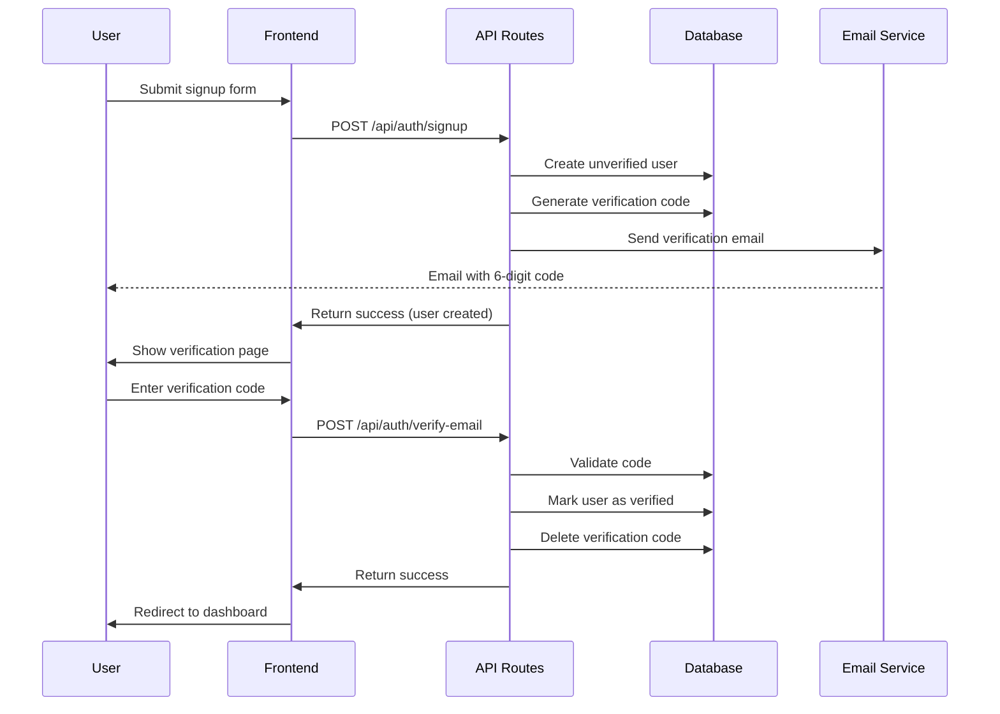

# Email Verification Design Document

## Overview

This design implements a secure email verification system for user accounts using a third-party email service. The system generates 6-digit verification codes, sends them via email, and validates user input with proper security measures including rate limiting, expiration, and cleanup processes.

## Architecture

### High-Level Flow



### Email Service Selection

**Recommended: Resend**
- Free tier: 3,000 emails/month, 100 emails/day
- Simple API, excellent developer experience
- Built for developers, reliable delivery
- Easy integration with Next.js

**Alternative: SendGrid**
- Free tier: 100 emails/day
- More complex but feature-rich
- Established service with good deliverability

**Alternative: Mailgun**
- Free tier: 5,000 emails/month (first 3 months)
- Good API, reliable service
- Flexible pricing model

## Components and Interfaces

### Database Schema Updates

#### New Table: emailVerificationCodes

```sql
CREATE TABLE email_verification_codes (
  id SERIAL PRIMARY KEY,
  user_id INTEGER NOT NULL REFERENCES users(id) ON DELETE CASCADE,
  code VARCHAR(6) NOT NULL,
  expires_at TIMESTAMP NOT NULL,
  created_at TIMESTAMP DEFAULT NOW(),
  attempts_used INTEGER DEFAULT 0,
  
  INDEX idx_user_id (user_id),
  INDEX idx_expires_at (expires_at),
  UNIQUE KEY unique_active_code (user_id, expires_at)
);
```

#### Users Table Update

```sql
ALTER TABLE users ADD COLUMN is_email_verified BOOLEAN DEFAULT FALSE;
CREATE INDEX idx_users_email_verified ON users(is_email_verified);
```

### API Endpoints

#### POST /api/auth/signup
```typescript
interface SignupRequest {
  email: string;
  password: string;
  name: string;
}

interface SignupResponse {
  success: boolean;
  message: string;
  requiresVerification: boolean;
}
```

#### POST /api/auth/verify-email
```typescript
interface VerifyEmailRequest {
  email: string;
  code: string;
}

interface VerifyEmailResponse {
  success: boolean;
  message: string;
  redirectTo?: string;
}
```

#### POST /api/auth/resend-verification
```typescript
interface ResendVerificationRequest {
  email: string;
}

interface ResendVerificationResponse {
  success: boolean;
  message: string;
  cooldownSeconds?: number;
}
```

### Email Service Integration

#### Email Service Interface

```typescript
interface EmailService {
  sendVerificationEmail(email: string, code: string, name: string): Promise<boolean>;
}

interface EmailConfig {
  apiKey: string;
  fromEmail: string;
  fromName: string;
}
```

#### Resend Implementation

```typescript
class ResendEmailService implements EmailService {
  private resend: Resend;
  
  constructor(config: EmailConfig) {
    this.resend = new Resend(config.apiKey);
  }
  
  async sendVerificationEmail(email: string, code: string, name: string): Promise<boolean> {
    // Implementation with retry logic and error handling
  }
}
```

### Frontend Components

#### EmailVerificationPage Component

```typescript
interface EmailVerificationPageProps {
  email: string;
  onVerificationSuccess: () => void;
}

// Features:
// - 6-digit code input with auto-formatting
// - Resend button with cooldown timer
// - Error message display
// - Loading states
// - Auto-submit when 6 digits entered
```

#### VerificationCodeInput Component

```typescript
interface VerificationCodeInputProps {
  value: string;
  onChange: (value: string) => void;
  disabled?: boolean;
  error?: string;
}

// Features:
// - 6 individual input boxes
// - Auto-focus next input on digit entry
// - Backspace handling
// - Paste support for full codes
```

## Data Models

### EmailVerificationCode Model

```typescript
interface EmailVerificationCode {
  id: number;
  userId: number;
  code: string;
  expiresAt: Date;
  createdAt: Date;
  attemptsUsed: number;
}

class EmailVerificationCodeService {
  async generateCode(userId: number): Promise<string>;
  async validateCode(email: string, code: string): Promise<boolean>;
  async incrementAttempts(codeId: number): Promise<void>;
  async cleanupExpiredCodes(): Promise<void>;
  async deleteUserCodes(userId: number): Promise<void>;
}
```

### User Model Updates

```typescript
interface User {
  id: number;
  email: string;
  name: string;
  passwordHash: string;
  isEmailVerified: boolean; // New field
  createdAt: Date;
  updatedAt: Date;
}
```

## Error Handling

### Email Service Errors

```typescript
class EmailServiceError extends Error {
  constructor(
    message: string,
    public code: 'QUOTA_EXCEEDED' | 'API_ERROR' | 'NETWORK_ERROR' | 'INVALID_EMAIL'
  ) {
    super(message);
  }
}

// Retry logic with exponential backoff
async function sendEmailWithRetry(
  emailService: EmailService,
  email: string,
  code: string,
  name: string,
  maxRetries = 3
): Promise<boolean> {
  // Implementation with exponential backoff
}
```

### Validation Errors

```typescript
enum VerificationError {
  CODE_EXPIRED = 'CODE_EXPIRED',
  CODE_INVALID = 'CODE_INVALID',
  TOO_MANY_ATTEMPTS = 'TOO_MANY_ATTEMPTS',
  RATE_LIMITED = 'RATE_LIMITED',
  USER_NOT_FOUND = 'USER_NOT_FOUND',
  ALREADY_VERIFIED = 'ALREADY_VERIFIED'
}
```

### Rate Limiting

```typescript
interface RateLimitConfig {
  maxVerificationAttempts: 5; // Per code
  maxResendRequests: 5; // Per hour per email
  resendCooldown: 60; // Seconds between resends
  maxCodesPerHour: 10; // Per email address
}
```

## Testing Strategy

### Unit Tests

#### Email Service Tests
- Mock Resend API responses
- Test retry logic with different error scenarios
- Validate email template rendering
- Test rate limiting and quota handling

#### Verification Logic Tests
- Code generation (uniqueness, format)
- Code validation (correct, expired, invalid)
- Attempt counting and limits
- Cleanup processes

#### Database Tests
- Schema validation
- Index performance
- Cascade deletion
- Concurrent access scenarios

### Integration Tests

#### Complete Verification Flow
1. User signup → code generation → email sent
2. Code entry → validation → user verification
3. Resend functionality with cooldown
4. Rate limiting enforcement
5. Cleanup job execution

#### Error Scenarios
- Email service unavailable
- Database connection issues
- Invalid user states
- Concurrent verification attempts

#### Security Tests
- Brute force protection
- Code enumeration prevention
- Rate limit bypass attempts
- SQL injection in verification endpoints

### End-to-End Tests

#### User Journey Tests
- Complete signup and verification flow
- Resend code functionality
- Error message display
- Redirect behavior after verification

#### Browser Tests
- Code input component behavior
- Auto-formatting and validation
- Paste functionality
- Mobile responsiveness

## Security Considerations

### Code Generation
- Use cryptographically secure random number generation
- Ensure codes are truly random (no patterns)
- Generate codes server-side only

### Rate Limiting Implementation
- Track attempts by IP address and email
- Implement sliding window rate limiting
- Use Redis or database for distributed rate limiting

### Data Protection
- Hash verification codes in database (optional for short-lived codes)
- Encrypt email service API keys
- Log security events without exposing sensitive data

### Authentication Middleware Updates
```typescript
async function requireEmailVerification(
  request: NextRequest,
  context: { params: Promise<any> }
) {
  const { user } = await validateRequest();
  
  if (!user) {
    return NextResponse.redirect('/auth/signin');
  }
  
  if (!user.isEmailVerified) {
    return NextResponse.redirect('/auth/verify-email');
  }
  
  return NextResponse.next();
}
```

## Environment Configuration

### Required Environment Variables

```bash
# Email Service (Resend)
RESEND_API_KEY=re_xxxxxxxxxx
FROM_EMAIL=send.mail.fancy-planties.cloudagrapher.com
FROM_NAME="Fancy Planties"

# Verification Settings
VERIFICATION_CODE_EXPIRY_MINUTES=10
MAX_VERIFICATION_ATTEMPTS=5
RESEND_COOLDOWN_SECONDS=60
MAX_RESEND_PER_HOUR=5

# Optional: Custom email templates
EMAIL_TEMPLATE_ID=template_xxxxxxxxxx
```

### Domain Setup Requirements

**Domain Configuration for Resend:**
- Primary domain: `fancy-planties.cloudagrapher.com`
- Email subdomain: `send.mail.fancy-planties.cloudagrapher.com`
- Required DNS records (provided by Resend):
  - SPF record for sender authentication
  - DKIM record for email signing
  - DMARC record for email policy

**Setup Steps:**
1. Add domain `fancy-planties.cloudagrapher.com` in Resend dashboard
2. Configure DNS records as provided by Resend
3. Verify domain ownership in Resend
4. Use `send.mail.fancy-planties.cloudagrapher.com` as FROM_EMAIL

### Development vs Production

```typescript
const emailConfig = {
  apiKey: process.env.RESEND_API_KEY!,
  fromEmail: process.env.FROM_EMAIL || 'send.mail.fancy-planties.cloudagrapher.com',
  fromName: process.env.FROM_NAME || 'Fancy Planties',
  isDevelopment: process.env.NODE_ENV === 'development'
};

// In development, optionally log codes to console
if (emailConfig.isDevelopment) {
  console.log(`Verification code for ${email}: ${code}`);
}
```

## Performance Optimizations

### Database Optimizations
- Index on (user_id, expires_at) for efficient cleanup
- Partition table by creation date for large volumes
- Regular cleanup job to prevent table bloat

### Caching Strategy
- Cache rate limit counters in Redis
- Cache email service configuration
- Cache user verification status briefly

### Background Jobs
- Cleanup expired codes every hour
- Monitor email service quota usage
- Generate usage reports for administrators

This design provides a robust, secure, and scalable email verification system that integrates seamlessly with the existing authentication infrastructure while leveraging reliable third-party email services.