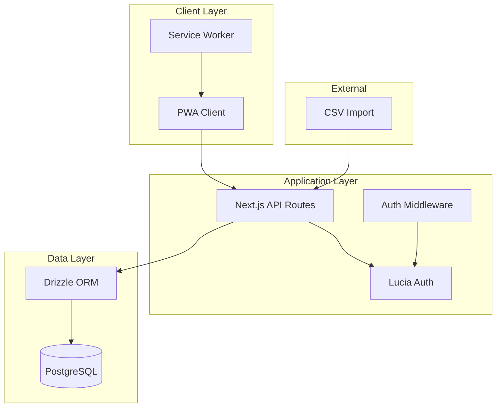
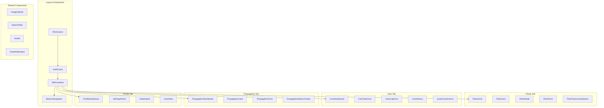
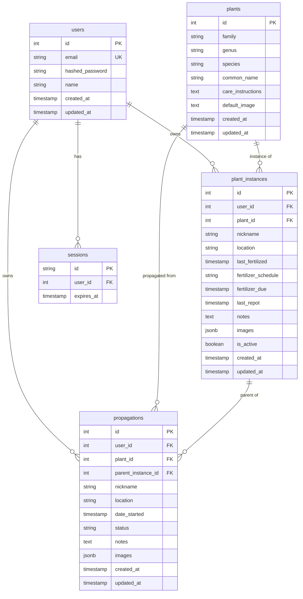
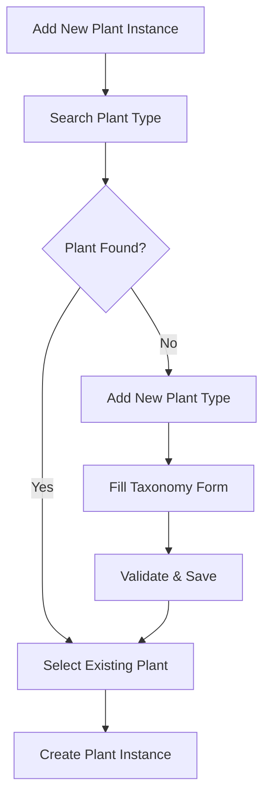
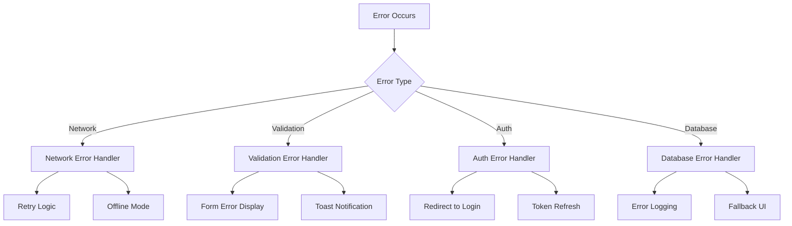
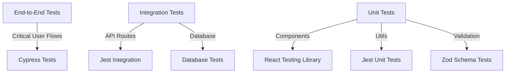
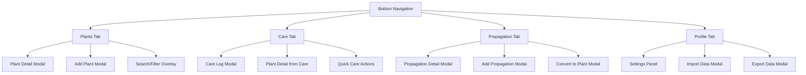

# Design Document

## Overview

The Plant Tracker App is a mobile-native Progressive Web Application (PWA) built with Next.js 15 App Router, featuring bottom navigation for an intuitive, app-like experience. The application replaces spreadsheet-based plant management with a touch-optimized, four-tab interface: Plants, Care, Propagation, and Profile. The architecture follows modern mobile design patterns optimized for performance, maintainability, and native-like user experience.

### Key Design Principles

- **Mobile-Native**: Bottom navigation with tab-based architecture for native app feel
- **Progressive Enhancement**: Works offline with service worker caching
- **User Data Segregation**: Row-level security ensures user privacy
- **Lightweight & Fast**: Minimal bundle size with efficient loading
- **LLM-Friendly**: Clean, well-documented codebase for AI assistance

## Architecture

### Technology Stack

| Component          | Technology             | Rationale                                                                     |
| ------------------ | ---------------------- | ----------------------------------------------------------------------------- |
| **Framework**      | Next.js 15 App Router  | Static export capability, excellent TypeScript support, built-in PWA features |
| **Database**       | PostgreSQL             | Row-level security, JSONB support, mature ecosystem                           |
| **ORM**            | Drizzle                | TypeScript-first, lightweight, excellent developer experience                 |
| **Authentication** | Lucia Auth             | Simple PostgreSQL integration, session-based auth, extensible                 |
| **Styling**        | Tailwind CSS           | Mobile-first utilities, rapid development, consistent design system           |
| **Image Storage**  | Base64 in Database     | MVP simplicity, easy migration path to file storage later                     |
| **Deployment**     | Docker + Static Export | Consistent development environment, flexible hosting options                  |

### System Architecture Diagram



## Components and Interfaces

### Core Components Architecture



### Component Specifications

#### BottomNavigation Component
- **Purpose**: Primary navigation with four main tabs
- **Features**: Active state indicators, smooth transitions, badge notifications for overdue care
- **Props**: `activeTab`, `onTabChange`, `careOverdueCount`
- **Tabs**: Plants (grid icon), Care (heart icon), Propagation (seedling icon), Profile (user icon)
- **Responsive**: Fixed bottom position with safe area padding

#### TabContainer Component
- **Purpose**: Manages tab content switching and state preservation
- **Features**: Lazy loading of tab content, maintains scroll position, smooth transitions
- **State Management**: Preserves each tab's state when switching
- **Performance**: Only renders active tab content, preloads adjacent tabs

#### CareDashboard Component
- **Purpose**: Central hub for all care-related activities
- **Features**: 
  - Overdue tasks section (red indicators)
  - Due today section (yellow indicators)
  - Upcoming care section (green indicators)
  - Quick action buttons for common care tasks
  - Care statistics and streaks
- **Layout**: Prioritized list with visual urgency indicators
- **Actions**: Quick fertilize, quick repot, view plant details

#### PropagationDashboard Component
- **Purpose**: Overview of all propagation activities
- **Features**:
  - Active propagations grouped by status
  - Success rate statistics
  - Quick status update actions
  - Timeline view of propagation progress
- **Status Groups**: Started, Rooting, Planted, Established
- **Visual Design**: Progress bars and status badges

#### PlantCard Component
- **Purpose**: Mobile-optimized display of individual plants
- **Features**: Touch-friendly interactions, care status indicators, primary image display
- **Props**: `plant`, `showCareStatus`, `onSelect`, `size`
- **Responsive**: Adapts from grid layout on mobile to list on desktop

#### PlantGrid Component  
- **Purpose**: Main plant collection view with search and filtering
- **Features**: Virtual scrolling for performance, pull-to-refresh, infinite scroll
- **State Management**: Local state for filters, server state for plant data
- **Performance**: Virtualized rendering for large collections

#### PlantTaxonomySelector Component
- **Purpose**: Smart plant selection with autocomplete and add-new functionality
- **Features**: 
  - Autocomplete search across family, genus, species, common names
  - "Add new plant type" option when no matches found
  - Quick-add form for new taxonomy entries
  - Fuzzy matching for typos and variations
- **UX Flow**: Search → Select existing OR Add new → Confirm details

#### CareTracker Component
- **Purpose**: Fertilizer and repotting schedule management
- **Features**: Quick care logging, schedule visualization, overdue indicators
- **Integration**: Updates plant instance records, calculates next due dates

#### PropagationTracker Component
- **Purpose**: Track propagation attempts and success rates
- **Features**: Status progression, parent plant linking, conversion to full plants
- **Workflow**: Started → Rooting → Planted → Established → Converted

## Data Models

### Database Schema



### Plant Taxonomy Management

The system supports flexible plant taxonomy management with the following approach:

1. **Existing Plant Selection**: Users can search and select from existing plant taxonomy
2. **New Plant Addition**: Users can easily add new plant types when they don't exist
3. **Autocomplete System**: Smart search across all taxonomy fields
4. **User Contributions**: New plants added by users become available to all users

#### Plant Addition User Flow



### Data Model Interfaces

```typescript
interface Plant {
  id: number;
  family: string;
  genus: string;
  species: string;
  commonName: string;
  careInstructions?: string;
  defaultImage?: string;
  createdBy?: number; // User who added this plant type
  isVerified: boolean; // Admin-verified taxonomy
  createdAt: Date;
  updatedAt: Date;
}

interface PlantInstance {
  id: number;
  userId: number;
  plantId: number;
  nickname: string;
  location: string;
  lastFertilized?: Date;
  fertilizerSchedule: string;
  fertilizerDue?: Date;
  lastRepot?: Date;
  notes?: string;
  images: string[]; // Base64 encoded images
  isActive: boolean;
  createdAt: Date;
  updatedAt: Date;
  plant?: Plant; // Joined data
}

interface Propagation {
  id: number;
  userId: number;
  plantId: number;
  parentInstanceId?: number;
  nickname: string;
  location: string;
  dateStarted: Date;
  status: 'started' | 'rooting' | 'planted' | 'established';
  notes?: string;
  images: string[];
  createdAt: Date;
  updatedAt: Date;
  plant?: Plant;
  parentInstance?: PlantInstance;
}

interface User {
  id: number;
  email: string;
  name: string;
  createdAt: Date;
  updatedAt: Date;
}
```

### Plant Taxonomy Search and Management

#### Search Functionality
- **Fuzzy Search**: Matches partial names, handles typos
- **Multi-field Search**: Searches across family, genus, species, common name
- **Autocomplete**: Real-time suggestions as user types
- **Recent Selections**: Shows recently used plants first

#### Adding New Plant Types
- **Quick Add**: Minimal form for basic taxonomy info
- **Detailed Add**: Full form with care instructions and images
- **Validation**: Prevents duplicate entries, validates taxonomy format
- **Community Contribution**: New plants become available to all users

### CSV Import Data Mapping

Based on the provided CSV files, the import system will map:

**Plant List CSV** → `plants` table:
- Family → family
- Genus → genus  
- Species → species
- Common Name/Variety → common_name
- Auto-set: createdBy = import_user_id, isVerified = false

**Fertilizer Schedule CSV** → `plant_instances` table:
- Common Name/Variety → nickname (links to plant via fuzzy matching)
- Location → location
- Last Fertilized → last_fertilized
- Fertilizer Schedule → fertilizer_schedule
- Fertilizer Due → fertilizer_due
- Last Repot → last_repot

**Propagations CSV** → `propagations` table:
- Common Name/Variety → nickname (links to plant via fuzzy matching)
- Location → location
- Date Started → date_started

## Error Handling

### Error Handling Strategy



### Error Types and Responses

1. **Network Errors**
   - Automatic retry with exponential backoff
   - Graceful degradation to cached data
   - Offline mode activation

2. **Validation Errors**
   - Real-time form validation
   - Clear error messages
   - Field-level error highlighting

3. **Authentication Errors**
   - Automatic token refresh
   - Redirect to login when needed
   - Session timeout handling

4. **Database Errors**
   - Transaction rollback
   - Error logging for debugging
   - User-friendly error messages

## Testing Strategy

### Testing Pyramid



### Test Coverage Areas

1. **Unit Tests (70% of tests)**
   - Component rendering and interactions
   - Utility functions
   - Validation schemas
   - Business logic functions

2. **Integration Tests (25% of tests)**
   - API route functionality
   - Database operations
   - Authentication flows
   - CSV import processes

3. **End-to-End Tests (5% of tests)**
   - Critical user journeys
   - PWA installation
   - Offline functionality
   - Cross-browser compatibility

### Testing Tools and Configuration

- **Jest**: Unit and integration testing framework
- **React Testing Library**: Component testing utilities
- **Cypress**: End-to-end testing framework
- **MSW**: API mocking for tests
- **Testing Database**: Separate PostgreSQL instance for tests

## Performance Optimization

### Performance Strategy

1. **Bundle Optimization**
   - Code splitting by route
   - Dynamic imports for heavy components
   - Tree shaking for unused code
   - Image optimization with Next.js

2. **Database Performance**
   - Proper indexing on frequently queried columns
   - Query optimization with Drizzle
   - Connection pooling
   - Row-level security policies

3. **Caching Strategy**
   - Service worker for static assets
   - API response caching
   - Image caching with compression
   - Offline data synchronization

4. **Mobile Performance**
   - Touch-optimized interactions
   - Reduced animation complexity
   - Efficient scroll handling
   - Memory management for large lists

### Performance Metrics

- **First Contentful Paint**: < 1.5s
- **Largest Contentful Paint**: < 2.5s
- **Time to Interactive**: < 3.5s
- **Cumulative Layout Shift**: < 0.1
- **Bundle Size**: < 250KB gzipped

## Security Considerations

### Security Architecture

1. **Authentication Security**
   - Secure password hashing with bcrypt
   - Session-based authentication
   - CSRF protection
   - Rate limiting on auth endpoints

2. **Data Security**
   - Row-level security in PostgreSQL
   - Input validation with Zod schemas
   - SQL injection prevention via ORM
   - XSS protection with proper escaping

3. **API Security**
   - Authentication middleware on protected routes
   - Request validation
   - Error message sanitization
   - HTTPS enforcement in production

4. **Image Security**
   - File type validation
   - Size limits
   - Base64 encoding validation
   - Future: Signed URLs for file storage

### Security Policies

```sql
-- Row Level Security Example
CREATE POLICY user_plant_instances ON plant_instances
  FOR ALL TO authenticated_users
  USING (user_id = current_user_id());

CREATE POLICY user_propagations ON propagations
  FOR ALL TO authenticated_users  
  USING (user_id = current_user_id());
```

## Tab-Based Navigation Architecture

### Navigation Flow and State Management



### Tab Content Architecture

#### Plants Tab (`/dashboard/plants`)
- **Primary View**: Grid of plant cards with search/filter bar
- **Secondary Views**: Plant detail modal, add plant modal, plant form
- **State Preservation**: Maintains scroll position, search filters, selected plant
- **Quick Actions**: Add plant FAB, search toggle, filter toggle

#### Care Tab (`/dashboard/care`)
- **Primary View**: Care dashboard with task lists and quick actions
- **Secondary Views**: Care log modal, plant detail from care context
- **Real-time Updates**: Live countdown timers, overdue indicators
- **Quick Actions**: Mark care complete, snooze reminders, bulk actions

#### Propagation Tab (`/dashboard/propagation`)
- **Primary View**: Propagation dashboard grouped by status
- **Secondary Views**: Propagation detail modal, add propagation modal
- **Progress Tracking**: Visual progress indicators, status transitions
- **Quick Actions**: Update status, add propagation, convert to plant

#### Profile Tab (`/dashboard/profile`)
- **Primary View**: User profile with statistics and settings access
- **Secondary Views**: Settings panels, import/export modals
- **Features**: Usage statistics, data management, app preferences
- **Quick Actions**: Import data, export data, account settings

### Modal and Overlay System

#### Modal Types
1. **Full-Screen Modals**: Plant detail, propagation detail (mobile)
2. **Bottom Sheet Modals**: Quick actions, care logging (mobile)
3. **Centered Modals**: Confirmations, forms (tablet/desktop)
4. **Slide-in Panels**: Settings, filters (tablet/desktop)

#### Navigation Context Preservation
- **Back Button Behavior**: Returns to originating tab with preserved state
- **Deep Linking**: Direct links to specific plants/propagations maintain tab context
- **Modal Stack**: Supports nested modals with proper back navigation
- **Tab Memory**: Each tab remembers its last state when returning

### Mobile Navigation Patterns

#### Gesture Support
- **Swipe Between Tabs**: Horizontal swipe to change tabs (optional)
- **Pull-to-Refresh**: Available in all tab views
- **Swipe Actions**: Left/right swipe on cards for quick actions
- **Long Press**: Context menus on plant/propagation cards

#### Touch Optimization
- **Large Touch Targets**: Minimum 44px for all interactive elements
- **Thumb-Friendly Layout**: Important actions within thumb reach
- **Edge Gestures**: Respect system edge gestures (iOS/Android)
- **Safe Areas**: Proper padding for notches and home indicators

## Progressive Web App Features

### PWA Implementation

1. **Service Worker Strategy**
   - Cache-first for static assets
   - Network-first for API calls
   - Background sync for offline actions
   - Push notifications (future feature)

2. **Offline Functionality**
   - Cached plant data viewing
   - Offline care logging with sync
   - Image caching
   - Offline-first data mutations

3. **Native App Features**
   - App installation prompts
   - Standalone display mode
   - Custom splash screen
   - App shortcuts for quick actions

4. **Mobile Optimizations**
   - Touch-friendly interface
   - Swipe gestures
   - Pull-to-refresh
   - Haptic feedback where available

## Visual Design System

### Color Palette

**Primary Colors (Soft Pastel Green)**
- **Primary**: `#a7f3d0` (Emerald-200) - Main brand color, soft and dreamy
- **Primary Dark**: `#6ee7b7` (Emerald-300) - Hover states, pressed buttons
- **Primary Light**: `#d1fae5` (Emerald-100) - Subtle backgrounds, success states
- **Primary Accent**: `#34d399` (Emerald-400) - Active states, important highlights

**Secondary Colors (Warm Salmon/Coral)**
- **Secondary**: `#fda4af` (Rose-300) - Secondary actions, warm accents
- **Secondary Dark**: `#fb7185` (Rose-400) - Hover states for secondary elements
- **Secondary Light**: `#fecdd3` (Rose-200) - Gentle backgrounds, soft highlights
- **Secondary Accent**: `#f472b6` (Pink-400) - Special features, love/favorite actions

**Tertiary Colors (Soft Lavender)**
- **Tertiary**: `#c4b5fd` (Violet-300) - Tertiary actions, propagation features
- **Tertiary Dark**: `#a78bfa` (Violet-400) - Active tertiary states
- **Tertiary Light**: `#e0e7ff` (Indigo-100) - Subtle accents, info backgrounds

**Status Colors (Soft & Friendly)**
- **Success**: `#86efac` (Green-300) - Healthy plants, completed care
- **Warning**: `#fcd34d` (Amber-300) - Care due, gentle reminders
- **Danger**: `#fca5a5` (Red-300) - Overdue care, soft alerts
- **Info**: `#93c5fd` (Blue-300) - Information, tips, guidance

**Neutral Colors (Warm & Soft)**
- **Background**: `#fefefe` (Almost white with warmth) - Main background
- **Surface**: `#faf9f7` (Warm white) - Card surfaces, input backgrounds
- **Border**: `#f3f1ee` (Warm gray-100) - Borders, dividers
- **Text Primary**: `#374151` (Gray-700) - Main text (softer than pure black)
- **Text Secondary**: `#9ca3af` (Gray-400) - Secondary text, labels
- **Text Muted**: `#d1d5db` (Gray-300) - Placeholder text, disabled states

### Typography

**Font Family**: System font stack for optimal performance
```css
font-family: -apple-system, BlinkMacSystemFont, 'Segoe UI', Roboto, 'Helvetica Neue', Arial, sans-serif;
```

**Type Scale**
- **Display**: 2.25rem (36px) - App title, major headings
- **Heading 1**: 1.875rem (30px) - Page titles
- **Heading 2**: 1.5rem (24px) - Section headings
- **Heading 3**: 1.25rem (20px) - Card titles, plant names
- **Body Large**: 1.125rem (18px) - Important body text
- **Body**: 1rem (16px) - Default body text
- **Body Small**: 0.875rem (14px) - Secondary text, labels
- **Caption**: 0.75rem (12px) - Timestamps, metadata

### Component Design Specifications

#### PlantCard Design
- **Size**: 160px × 200px (mobile), 180px × 220px (tablet+)
- **Border Radius**: 16px for soft, Instagram-like aesthetic
- **Shadow**: Dreamy soft shadow with subtle color tint
- **Background**: Gradient from warm white to soft pastel
- **Image**: 160px × 120px with rounded top corners, soft overlay
- **Care Status**: Cute color-coded heart or plant icon (pastel green/salmon/lavender)
- **Typography**: Plant name in Heading 3, location in Body Small with soft gray text

#### Bottom Navigation Design
- **Bottom Tab Bar**: Fixed bottom navigation with soft gradient background and safe area support
- **Tab Height**: 64px base + safe area padding (up to 34px on iPhone)
- **Active State**: Primary pastel green with gentle glow and scale animation
- **Inactive State**: Soft gray with subtle hover effects
- **Icons**: 24px rounded, friendly icons with micro-animations
  - Plants: Grid/collection icon
  - Care: Heart with pulse animation for overdue items
  - Propagation: Seedling/sprout icon
  - Profile: User/person icon
- **Labels**: Body Small typography, hidden on smaller screens (<375px width)
- **Background**: Translucent white with backdrop blur and subtle shadow
- **Badges**: Small red notification badges for overdue care items
- **Haptic Feedback**: Gentle vibration on tab selection (iOS/Android)

#### Form Design
- **Input Height**: 48px for touch-friendly interaction
- **Border Radius**: 8px for consistency
- **Focus State**: Primary green border with subtle shadow
- **Error State**: Red border with error message below
- **Success State**: Green border with checkmark icon

### Mobile-First Design Patterns

#### Touch Targets
- **Minimum Size**: 44px × 44px (iOS guidelines)
- **Preferred Size**: 48px × 48px for better accessibility
- **Spacing**: 8px minimum between touch targets

#### Gestures
- **Swipe**: Left/right swipe on plant cards for quick actions
- **Pull-to-Refresh**: Standard iOS/Android pattern
- **Long Press**: Context menu for plant cards
- **Pinch-to-Zoom**: Image gallery viewing

#### Layout Patterns
- **Grid**: 2 columns on mobile, 3-4 on tablet, 4-6 on desktop
- **Spacing**: 16px base spacing unit, 8px for tight spacing
- **Margins**: 16px side margins on mobile, 24px on tablet+

### Dark Mode Support (Future Enhancement)

**Dark Color Palette**
- **Background**: `#0f172a` (Slate-900)
- **Surface**: `#1e293b` (Slate-800)
- **Primary**: `#34d399` (Emerald-400) - Adjusted for dark backgrounds
- **Text Primary**: `#f1f5f9` (Slate-100)
- **Text Secondary**: `#94a3b8` (Slate-400)

### Accessibility Considerations

#### Color Contrast
- **Text on Background**: Minimum 4.5:1 ratio (WCAG AA)
- **Large Text**: Minimum 3:1 ratio
- **Interactive Elements**: Clear focus indicators

#### Motion & Animation
- **Respect Reduced Motion**: Honor `prefers-reduced-motion` setting
- **Subtle Animations**: 200-300ms duration for micro-interactions
- **Loading States**: Skeleton screens and progress indicators

### PWA Manifest Configuration

```json
{
  "name": "Fancy Planties",
  "short_name": "Fancy Planties",
  "description": "Track your fancy plant collection with mobile-native navigation",
  "start_url": "/dashboard/plants",
  "display": "standalone",
  "orientation": "portrait-primary",
  "theme_color": "#a7f3d0",
  "background_color": "#ffffff",
  "categories": ["lifestyle", "productivity"],
  "shortcuts": [
    {
      "name": "Add Plant",
      "short_name": "Add Plant",
      "description": "Quickly add a new plant to your collection",
      "url": "/dashboard/plants?action=add",
      "icons": [{ "src": "/icons/add-plant-96.png", "sizes": "96x96" }]
    },
    {
      "name": "Care Tasks",
      "short_name": "Care",
      "description": "View overdue and upcoming care tasks",
      "url": "/dashboard/care",
      "icons": [{ "src": "/icons/care-96.png", "sizes": "96x96" }]
    },
    {
      "name": "Propagations",
      "short_name": "Props",
      "description": "Check propagation progress",
      "url": "/dashboard/propagation",
      "icons": [{ "src": "/icons/propagation-96.png", "sizes": "96x96" }]
    }
  ],
  "icons": [
    {
      "src": "/icons/icon-72.png",
      "sizes": "72x72",
      "type": "image/png"
    },
    {
      "src": "/icons/icon-96.png",
      "sizes": "96x96",
      "type": "image/png"
    },
    {
      "src": "/icons/icon-128.png",
      "sizes": "128x128",
      "type": "image/png"
    },
    {
      "src": "/icons/icon-144.png",
      "sizes": "144x144",
      "type": "image/png"
    },
    {
      "src": "/icons/icon-152.png",
      "sizes": "152x152",
      "type": "image/png"
    },
    {
      "src": "/icons/icon-192.png",
      "sizes": "192x192",
      "type": "image/png"
    },
    {
      "src": "/icons/icon-384.png",
      "sizes": "384x384",
      "type": "image/png"
    },
    {
      "src": "/icons/icon-512.png", 
      "sizes": "512x512",
      "type": "image/png"
    }
  ]
}
```

### Tailwind CSS Configuration

```javascript
module.exports = {
  theme: {
    extend: {
      colors: {
        // Pastel Green Primary
        primary: {
          50: '#f0fdf4',
          100: '#d1fae5', // Primary Light
          200: '#a7f3d0', // Primary (Main brand)
          300: '#6ee7b7', // Primary Dark
          400: '#34d399', // Primary Accent
          500: '#10b981',
          600: '#059669',
          700: '#047857',
          800: '#065f46',
          900: '#064e3b',
        },
        // Salmon/Coral Secondary
        secondary: {
          50: '#fff1f2',
          100: '#ffe4e6',
          200: '#fecdd3', // Secondary Light
          300: '#fda4af', // Secondary (Main)
          400: '#fb7185', // Secondary Dark
          500: '#f43f5e',
          600: '#e11d48',
          700: '#be123c',
          800: '#9f1239',
          900: '#881337',
        },
        // Soft Lavender Tertiary
        tertiary: {
          50: '#f5f3ff',
          100: '#e0e7ff', // Tertiary Light
          200: '#c7d2fe',
          300: '#c4b5fd', // Tertiary (Main)
          400: '#a78bfa', // Tertiary Dark
          500: '#8b5cf6',
          600: '#7c3aed',
          700: '#6d28d9',
          800: '#5b21b6',
          900: '#4c1d95',
        },
        // Accent Pink for special features
        accent: {
          300: '#f9a8d4',
          400: '#f472b6', // Secondary Accent
          500: '#ec4899',
        }
      },
      fontFamily: {
        sans: ['-apple-system', 'BlinkMacSystemFont', 'Segoe UI', 'Roboto', 'Helvetica Neue', 'Arial', 'sans-serif'],
      },
      spacing: {
        '18': '4.5rem',
        '88': '22rem',
      },
      borderRadius: {
        'xl': '16px', // Softer, more Instagram-like
        '2xl': '20px',
      },
      boxShadow: {
        'soft': '0 2px 15px -3px rgba(167, 243, 208, 0.1), 0 4px 6px -2px rgba(167, 243, 208, 0.05)',
        'dreamy': '0 8px 32px -8px rgba(253, 164, 175, 0.15), 0 0 0 1px rgba(167, 243, 208, 0.05)',
      }
    },
  },
}
```

This comprehensive visual design system ensures Fancy Planties will have a cohesive, plant-inspired aesthetic that feels natural and welcoming while maintaining excellent usability and accessibility standards.