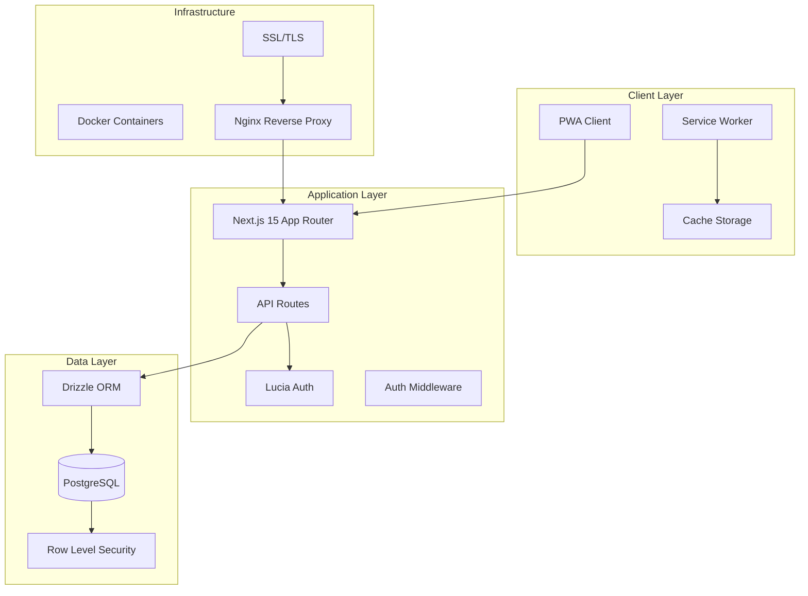
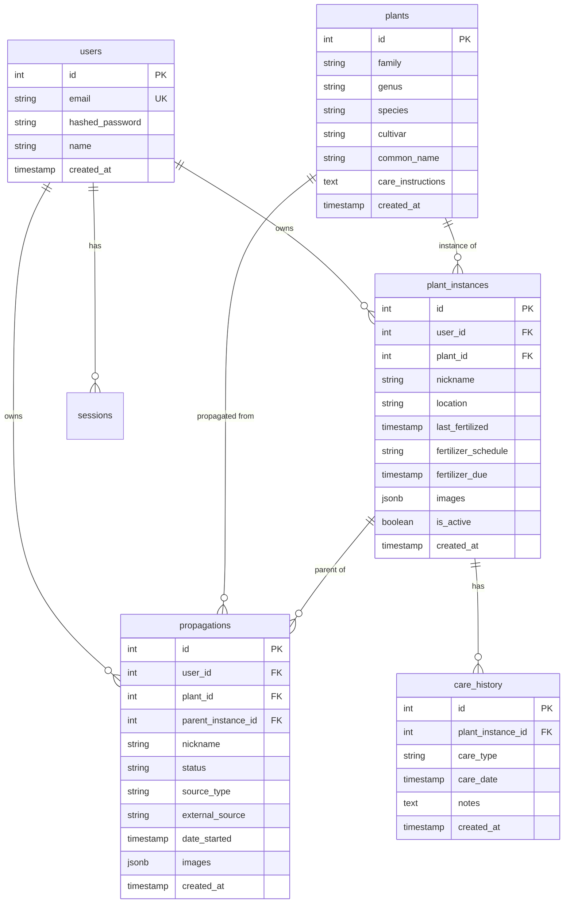
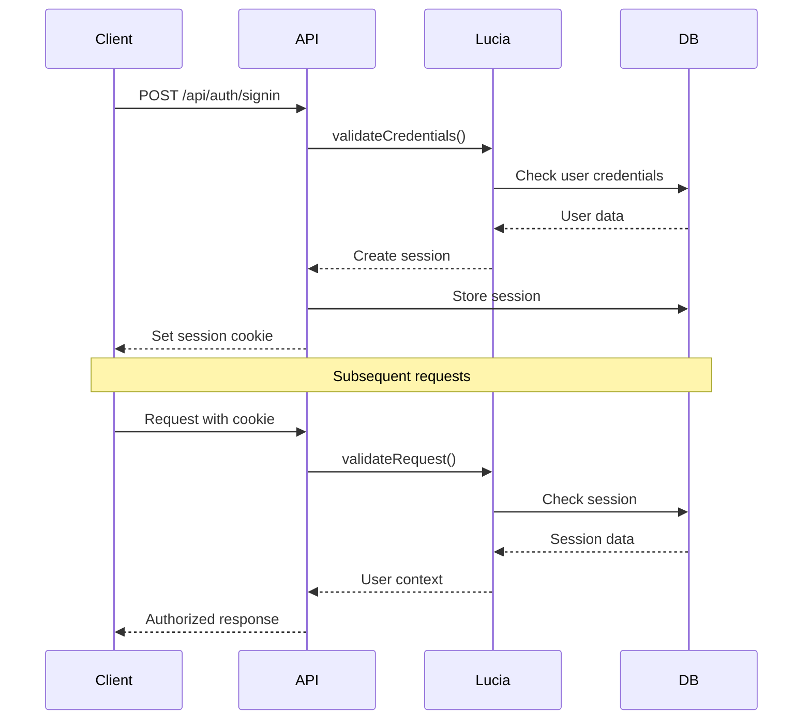
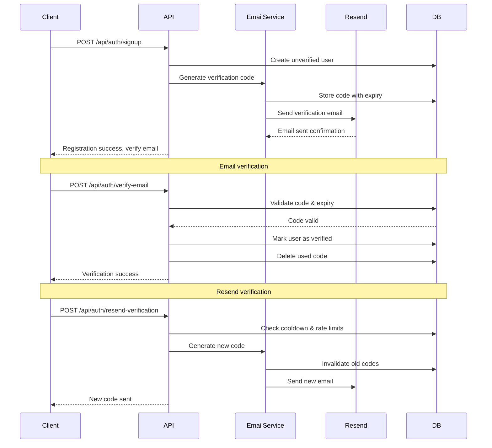
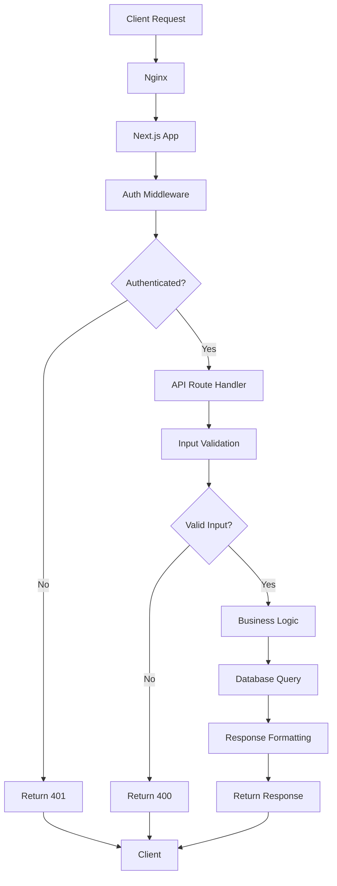
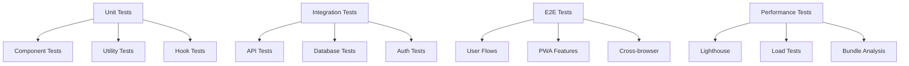

# Architecture Overview

This document provides a comprehensive overview of Fancy Planties' technical architecture, design decisions, and implementation patterns.

## 🏗️ System Architecture

### High-Level Architecture



### Technology Stack Rationale

| Technology | Purpose | Why Chosen |
|------------|---------|------------|
| **Next.js 15** | React Framework | App Router, SSR, static export, excellent TypeScript support |
| **PostgreSQL** | Database | ACID compliance, JSON support, row-level security, mature ecosystem |
| **Drizzle ORM** | Database ORM | TypeScript-first, lightweight, excellent DX, type safety |
| **Lucia Auth** | Authentication | Simple, secure, PostgreSQL integration, session-based |
| **Resend** | Email Service | Reliable transactional email, developer-friendly API, good deliverability |
| **Tailwind CSS** | Styling | Utility-first, mobile-first, rapid development, consistent design |
| **Docker** | Containerization | Consistent environments, easy deployment, scalability |

## 🎯 Design Principles

### 1. Mobile-First Architecture

The entire application is designed with mobile as the primary target:

- **Bottom Navigation**: Native app-like navigation pattern
- **Touch Optimization**: 44px+ touch targets, swipe gestures
- **Progressive Enhancement**: Works on all devices, enhanced on capable ones
- **Offline-First**: Core functionality available without internet

### 2. User Data Segregation

Every data access is filtered by user ID:

```sql
-- Row Level Security Policy Example
CREATE POLICY user_plant_instances ON plant_instances
  FOR ALL TO authenticated_users
  USING (user_id = current_user_id());
```

### 3. Type Safety Throughout

- **Database**: Drizzle provides compile-time type safety
- **API**: Zod schemas validate all inputs/outputs
- **Frontend**: Strict TypeScript configuration
- **Testing**: Type-safe mocks and fixtures

### 4. Performance-First

- **Bundle Splitting**: Automatic code splitting by route
- **Image Optimization**: Base64 storage with compression
- **Caching**: Service worker caches static assets
- **Database**: Proper indexing and query optimization

## 📱 Frontend Architecture

### Component Hierarchy

```
RootLayout
├── AuthGuard
├── ServiceWorkerProvider
├── QueryClientProvider
└── TabContainer
    ├── BottomNavigation
    ├── PlantsTab
    │   ├── PlantsGrid
    │   ├── PlantCard
    │   └── PlantDetailModal
    ├── CareTab
    │   ├── CareDashboard
    │   ├── CareTaskCard
    │   └── QuickCareActions
    ├── PropagationTab
    │   ├── PropagationDashboard
    │   └── PropagationCard
    └── ProfileTab
        ├── ProfileDashboard
        ├── DataImport
        └── SettingsPanel
```

### State Management Strategy

#### Server State (React Query)
- **Plant data**: Cached with automatic revalidation
- **Care schedules**: Real-time updates with optimistic updates
- **User preferences**: Persisted across sessions

#### Client State (React useState/useReducer)
- **UI state**: Modal visibility, form inputs, loading states
- **Navigation state**: Active tab, scroll positions
- **Temporary state**: Search queries, filter selections

#### Persistent State (localStorage/IndexedDB)
- **Offline data**: Cached for offline viewing
- **User preferences**: Theme, notification settings
- **Draft data**: Unsaved form data, offline actions

### Client/Server Component Separation

#### Server Components (Default)
```typescript
// Can access database directly
export default async function PlantsPage() {
  const plants = await db.select().from(plants);
  return <PlantsClient plants={plants} />;
}
```

#### Client Components ('use client')
```typescript
'use client';
export default function PlantsClient({ plants }: Props) {
  const [selected, setSelected] = useState<Plant | null>(null);
  // Interactive UI logic
}
```

## 🗄️ Database Architecture

### Schema Design

#### Core Entities



#### Indexing Strategy

```sql
-- Performance indexes
CREATE INDEX idx_plant_instances_user_id ON plant_instances(user_id);
CREATE INDEX idx_plant_instances_fertilizer_due ON plant_instances(fertilizer_due) WHERE is_active = true;
CREATE INDEX idx_propagations_user_status ON propagations(user_id, status);
CREATE INDEX idx_care_history_plant_date ON care_history(plant_instance_id, care_date DESC);

-- Search indexes
CREATE INDEX idx_plants_search ON plants USING gin(to_tsvector('english', 
  coalesce(family, '') || ' ' || 
  coalesce(genus, '') || ' ' || 
  coalesce(species, '') || ' ' || 
  coalesce(cultivar, '') || ' ' || 
  coalesce(common_name, '')
));
```

### Data Access Patterns

#### Repository Pattern
```typescript
// Plant Instance Repository
export class PlantInstanceRepository {
  async findByUser(userId: number): Promise<PlantInstance[]> {
    return await db
      .select()
      .from(plantInstances)
      .leftJoin(plants, eq(plantInstances.plantId, plants.id))
      .where(eq(plantInstances.userId, userId));
  }

  async findOverdue(userId: number): Promise<PlantInstance[]> {
    return await db
      .select()
      .from(plantInstances)
      .where(
        and(
          eq(plantInstances.userId, userId),
          lt(plantInstances.fertilizerDue, new Date()),
          eq(plantInstances.isActive, true)
        )
      );
  }
}
```

## 🔐 Authentication & Security

### Authentication Flow



### Email Verification Flow



### Security Measures

#### Input Validation
```typescript
// Zod schema validation
const createPlantSchema = z.object({
  plantId: z.number().positive(),
  nickname: z.string().min(1).max(100),
  location: z.string().min(1).max(100),
  fertilizerSchedule: z.enum(['weekly', 'biweekly', 'monthly']),
});

export async function POST(request: NextRequest) {
  const body = await request.json();
  const validated = createPlantSchema.parse(body); // Throws if invalid
  // Process validated data
}
```

#### Email Verification Security
```typescript
// Secure verification code generation
export class EmailVerificationCodeService {
  generateSecureCode(): string {
    // Cryptographically secure 6-digit code
    return crypto.randomInt(100000, 999999).toString();
  }

  async validateCode(email: string, code: string): Promise<boolean> {
    const storedCode = await this.getStoredCode(email);
    
    // Check expiry (10 minutes)
    if (storedCode.expiresAt < new Date()) {
      await this.deleteCode(email);
      return false;
    }

    // Check attempt limits (5 attempts max)
    if (storedCode.attempts >= 5) {
      await this.deleteCode(email);
      return false;
    }

    // Increment attempts and validate
    await this.incrementAttempts(email);
    return storedCode.code === code;
  }
}

// Rate limiting for verification endpoints
const verificationLimiter = rateLimit({
  windowMs: 60 * 60 * 1000, // 1 hour
  max: 5, // 5 attempts per hour
  message: 'Too many verification attempts',
});

const resendLimiter = rateLimit({
  windowMs: 60 * 1000, // 1 minute
  max: 1, // 1 resend per minute
  message: 'Please wait before requesting another code',
});
```

#### Row Level Security
```sql
-- Enable RLS on all user tables
ALTER TABLE plant_instances ENABLE ROW LEVEL SECURITY;
ALTER TABLE propagations ENABLE ROW LEVEL SECURITY;
ALTER TABLE care_history ENABLE ROW LEVEL SECURITY;

-- Policies ensure users only see their data
CREATE POLICY user_plant_instances ON plant_instances
  FOR ALL TO authenticated_users
  USING (user_id = current_user_id());
```

## 📱 Progressive Web App Architecture

### Service Worker Strategy

```typescript
// Cache-first for static assets
const STATIC_CACHE = 'fancy-planties-static-v1';
const DYNAMIC_CACHE = 'fancy-planties-dynamic-v1';

self.addEventListener('fetch', (event) => {
  if (event.request.url.includes('/api/')) {
    // Network-first for API calls
    event.respondWith(networkFirstStrategy(event.request));
  } else {
    // Cache-first for static assets
    event.respondWith(cacheFirstStrategy(event.request));
  }
});
```

### Offline Functionality

#### Data Synchronization
```typescript
// Offline action queue
interface OfflineAction {
  id: string;
  type: 'CREATE_PLANT' | 'LOG_CARE' | 'UPDATE_PLANT';
  data: any;
  timestamp: number;
}

class OfflineManager {
  async queueAction(action: OfflineAction) {
    const queue = await this.getQueue();
    queue.push(action);
    await this.saveQueue(queue);
  }

  async syncWhenOnline() {
    if (navigator.onLine) {
      const queue = await this.getQueue();
      for (const action of queue) {
        await this.processAction(action);
      }
      await this.clearQueue();
    }
  }
}
```

## 🚀 Performance Optimization

### Bundle Optimization

#### Code Splitting
```typescript
// Dynamic imports for heavy components
const PlantDetailModal = dynamic(() => import('./PlantDetailModal'), {
  loading: () => <PlantDetailSkeleton />,
});

// Route-based splitting (automatic with App Router)
// Each page in app/ directory is automatically split
```

#### Tree Shaking
```typescript
// Import only what you need
import { eq, and, lt } from 'drizzle-orm'; // ✅ Good
import * as drizzle from 'drizzle-orm'; // ❌ Imports everything
```

### Database Performance

#### Query Optimization
```typescript
// Efficient queries with proper joins
export async function getPlantInstancesWithCareStatus(userId: number) {
  return await db
    .select({
      id: plantInstances.id,
      nickname: plantInstances.nickname,
      fertilizerDue: plantInstances.fertilizerDue,
      isOverdue: sql<boolean>`${plantInstances.fertilizerDue} < NOW()`,
      plant: {
        genus: plants.genus,
        species: plants.species,
      }
    })
    .from(plantInstances)
    .leftJoin(plants, eq(plantInstances.plantId, plants.id))
    .where(eq(plantInstances.userId, userId))
    .orderBy(plantInstances.fertilizerDue);
}
```

#### Connection Pooling
```typescript
// Database connection with pooling
export const db = drizzle(postgres(DATABASE_URL, {
  max: 20, // Maximum connections
  idle_timeout: 30000, // 30 seconds
  connect_timeout: 60000, // 60 seconds
}));
```

## 🔄 Data Flow Architecture

### Request Lifecycle



### State Synchronization

#### Optimistic Updates
```typescript
// React Query optimistic update pattern
const updatePlantMutation = useMutation({
  mutationFn: updatePlant,
  onMutate: async (newPlant) => {
    // Cancel outgoing refetches
    await queryClient.cancelQueries(['plants']);
    
    // Snapshot previous value
    const previousPlants = queryClient.getQueryData(['plants']);
    
    // Optimistically update
    queryClient.setQueryData(['plants'], (old: Plant[]) =>
      old.map(plant => plant.id === newPlant.id ? newPlant : plant)
    );
    
    return { previousPlants };
  },
  onError: (err, newPlant, context) => {
    // Rollback on error
    queryClient.setQueryData(['plants'], context?.previousPlants);
  },
  onSettled: () => {
    // Refetch to ensure consistency
    queryClient.invalidateQueries(['plants']);
  },
});
```

## 🧪 Testing Architecture

### Testing Strategy



### Test Execution Optimization

The testing infrastructure is optimized for both development speed and CI/CD efficiency:

#### Parallel Execution Strategy
```javascript
// Jest configuration for optimal performance
const testConfig = {
  // Dynamic worker allocation based on environment
  maxWorkers: process.env.CI ? 2 : '50%',
  
  // Memory management to prevent leaks
  workerIdleMemoryLimit: '512MB',
  
  // Test isolation for reliable results
  resetMocks: true,
  clearMocks: true,
  restoreMocks: true,
  
  // Performance optimizations
  cache: true,
  cacheDirectory: '<rootDir>/.jest-cache',
  
  // CI-specific optimizations
  bail: process.env.CI ? 1 : 0, // Fail fast in CI
  detectOpenHandles: true,
  forceExit: true,
};
```

#### Environment-Specific Configuration

**Local Development:**
- Uses 50% of available CPU cores for parallel execution
- Enables caching for faster subsequent runs
- Continues running all tests even after failures for comprehensive feedback

**CI/CD Environment:**
- Uses 2 workers to balance speed with resource constraints
- Fails fast on first test failure to save CI time
- Generates JUnit XML reports for integration with CI systems

#### Performance Metrics

- **Local Test Execution**: ~30-50% faster with parallel workers
- **CI Test Execution**: Optimized for resource efficiency and fast feedback
- **Memory Usage**: Controlled with 512MB worker limits to prevent OOM errors
- **Cache Hit Rate**: ~70-80% cache hits on subsequent runs

### Test Utilities

#### Component Testing
```typescript
// Test utilities for consistent testing
export function renderWithProviders(
  ui: React.ReactElement,
  options: RenderOptions = {}
) {
  const queryClient = new QueryClient({
    defaultOptions: { queries: { retry: false } },
  });

  function Wrapper({ children }: { children: React.ReactNode }) {
    return (
      <QueryClientProvider client={queryClient}>
        <AuthProvider>
          {children}
        </AuthProvider>
      </QueryClientProvider>
    );
  }

  return render(ui, { wrapper: Wrapper, ...options });
}
```

#### API Testing
```typescript
// API test helpers
export async function createTestUser(): Promise<User> {
  const user = await db.insert(users).values({
    email: `test-${Date.now()}@example.com`,
    hashedPassword: await hash('password'),
    name: 'Test User',
  }).returning();
  
  return user[0];
}

export async function authenticatedRequest(
  method: string,
  url: string,
  user: User,
  body?: any
) {
  const session = await createSession(user.id);
  return request(app)
    [method.toLowerCase()](url)
    .set('Cookie', `auth_session=${session.id}`)
    .send(body);
}
```

## 🔍 Monitoring & Observability

### Application Monitoring

#### Performance Metrics
```typescript
// Custom monitoring service
class MonitoringService {
  recordMetric(name: string, value: number, tags?: Record<string, string>) {
    // Send to monitoring service (DataDog, New Relic, etc.)
    if (process.env.NODE_ENV === 'production') {
      this.sendToExternalService({ name, value, tags, timestamp: Date.now() });
    }
  }

  recordApiRequest(method: string, path: string, statusCode: number, duration: number) {
    this.recordMetric('api_request_duration', duration, {
      method,
      path,
      status_code: statusCode.toString(),
    });
  }
}
```

#### Error Tracking
```typescript
// Structured error logging
export class Logger {
  error(message: string, error?: Error, context?: Record<string, any>) {
    const logEntry = {
      level: 'error',
      message,
      timestamp: new Date().toISOString(),
      error: error ? {
        name: error.name,
        message: error.message,
        stack: error.stack,
      } : undefined,
      context,
    };

    // Send to external logging service
    this.sendToLoggingService(logEntry);
  }
}
```

## 🚀 Deployment Architecture

### Container Strategy

```dockerfile
# Multi-stage build for optimization
FROM node:20-alpine AS deps
WORKDIR /app
COPY package*.json ./
RUN npm ci --only=production

FROM node:20-alpine AS builder
WORKDIR /app
COPY --from=deps /app/node_modules ./node_modules
COPY . .
RUN npm run build

FROM node:20-alpine AS runner
WORKDIR /app
ENV NODE_ENV production
RUN addgroup --system --gid 1001 nodejs
RUN adduser --system --uid 1001 nextjs
COPY --from=builder --chown=nextjs:nodejs /app/.next/standalone ./
COPY --from=builder --chown=nextjs:nodejs /app/.next/static ./.next/static
USER nextjs
CMD ["node", "server.js"]
```

### Infrastructure as Code

```yaml
# Docker Compose production configuration
version: '3.8'
services:
  app:
    build: .
    restart: unless-stopped
    environment:
      - NODE_ENV=production
    depends_on:
      - postgres
    networks:
      - app-network

  postgres:
    image: postgres:16-alpine
    restart: unless-stopped
    environment:
      - POSTGRES_DB=${POSTGRES_DB}
      - POSTGRES_USER=${POSTGRES_USER}
      - POSTGRES_PASSWORD=${POSTGRES_PASSWORD}
    volumes:
      - postgres_data:/var/lib/postgresql/data
    networks:
      - app-network

  nginx:
    image: nginx:alpine
    restart: unless-stopped
    ports:
      - "80:80"
      - "443:443"
    volumes:
      - ./nginx:/etc/nginx/conf.d
      - ./ssl:/etc/nginx/ssl
    depends_on:
      - app
    networks:
      - app-network

networks:
  app-network:
    driver: bridge

volumes:
  postgres_data:
```

## 🔮 Future Architecture Considerations

### Scalability Improvements

1. **Microservices**: Split into plant service, care service, user service
2. **Event-Driven**: Use message queues for async processing
3. **Caching Layer**: Redis for session storage and caching
4. **CDN**: CloudFront for static asset delivery
5. **Database Scaling**: Read replicas, connection pooling

### Technology Evolution

1. **React Server Components**: Leverage new React features
2. **Edge Computing**: Deploy to edge locations for better performance
3. **AI Integration**: Plant identification, care recommendations
4. **Real-time Features**: WebSocket for live updates
5. **Mobile Apps**: React Native for native mobile experience

---

This architecture provides a solid foundation for a scalable, maintainable, and performant plant management application while maintaining simplicity and developer experience.